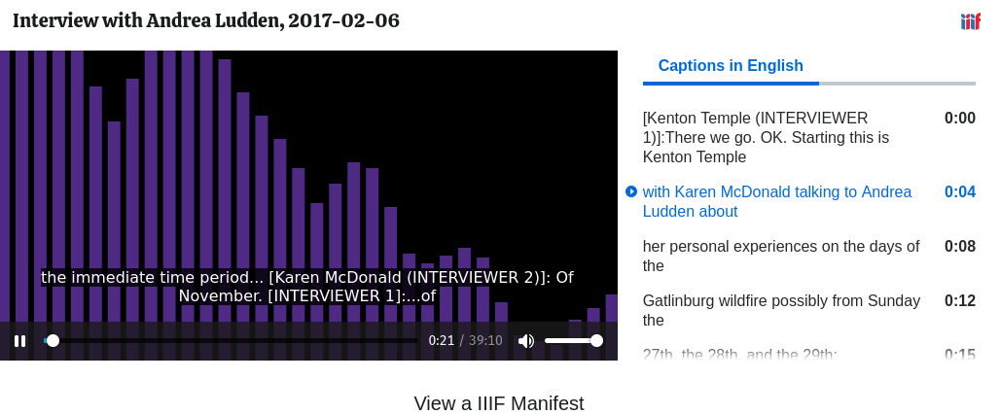
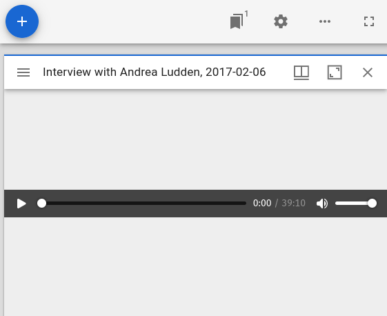
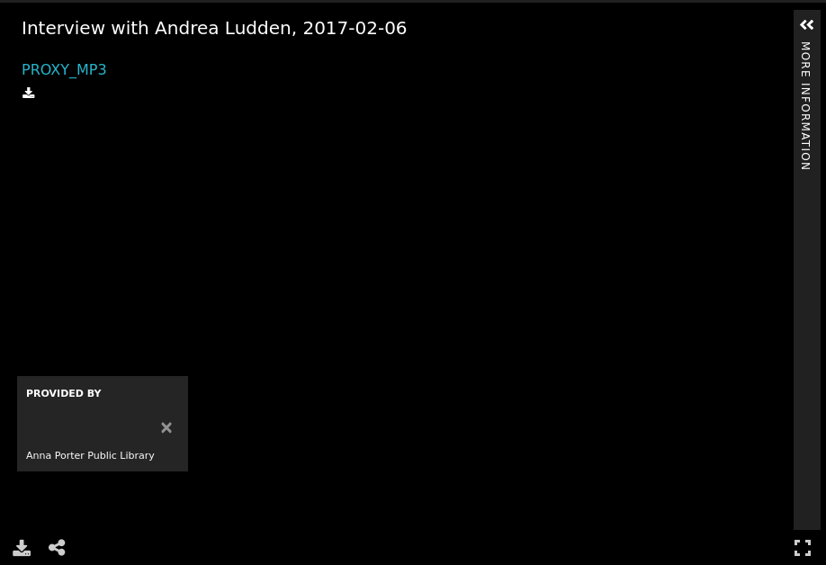

.. _Audio Works:

Audio
=====

About
-----

In University of Tennessee Digital Collections, digital objects whose primary file is sound are considered to be Audio.
Audio works usually consist of a preservation file stored in audio/mpge format with a PROXY_MP3 access copy.
Like other content models, a :code:`Audio` work may be a part of a :code:`Compound Object`.

Fedora Model
------------

Audio works always have structural properties that state their content model and the collections in which they are
members.  Their files may also have a :code:`bibframe:duration` that state how long they are.

.. code-block:: turtle

    @prefix fedora: <info:fedora/fedora-system:def/relations-external#> .
    @prefix fedora-model: <info:fedora/fedora-system:def/model#> .
    @prefix islandora: <http://islandora.ca/ontology/relsext#> .

    <info:fedora/rfta:156> fedora-model:hasModel <info:fedora/islandora:sp-audioCModel> ;
        fedora:isMemberOfCollection <info:fedora/collections:rfta> .

    <info:fedora/rfta:156/PROXY_MP3> bibframe:duration "00:20:53" .

If they are parts of compound objects or have restrictions, they may also have additional properties.

IIIF Manifest
-------------

The IIIF manifest for an :code:`Audio` work inherits the basic format for other manifests. For more information, see
:ref:`Base Manifest Properties`.

This manifest is very similar to that of a video but with slightly few parts.

The :code:`items` property of the manifest for an Audio work has one canvas that points at the :code:`PROXY_MP3`
datastream. The :code:`Canvas` should have :code:`id`, :code:`type`, :code:`label`, :code:`thumbnail`, :code:`width`,
:code:`height`, :code:`duration`, :code:`items`, and :code:`annotations` properties following the IIIF Presentation v3
specification.

The :code:`thumbnail` property for an Audio :code:`Canvas` is the same as most work types. The array has one value that
is populated by Cantaloupe acting on the :code:`TN` datastream. The :code:`id` property points at a Cantaloupe request
for the full thumbnail.  The :code:`service` property points at the Cantaloupe service so that requests can be refined by
consuming applications.  The :code:`width` and :code:`height` are derived from Cantaloupe. The :code:`type` and
:code:`format` properties express format and mime type.

The :code:`duration` value is derived from the :code:`bibframe:duration` property that describes the work's :code:`PROXY_MP3`
datastream.

Currently, the :code:`height` and :code:`width` properties are hard coded.  This should ideally be rethought and arguably
should not exist at all.

Audio works may have one or more subtitle or closed captioning file. When they do, they are added as :code:`AnnotationPages`
in the :code:`annotations` property. Right now, a closed captioning file can only be Spanish or English and based on the
name of the datastream the correct Annotation is added with the motivation of supplementing. The :code:`TRANSCRIPT` datastream
is reserved for English and the :code:`TRANSCRIPT-ES` datastream is reserved for Spanish:

.. literalinclude:: ../fixtures/rfta_118.json
    :language: json
    :linenos:
    :lines: 270-294

Audio works are also special in that the manifest may have a :code:`structures` property with ranges.  This property provides
a table of contents of sorts that may be functional in some viewers according to IIIF presentation v3 specification.

The :code:`structures` property has :code:`1-n` ranges declared in it. In our sample we have 3:

.. literalinclude:: ../fixtures/rfta_118.json
    :language: json
    :linenos:
    :lines: 371-380,441-451,497-507,598,599

Each of these ranges provide independent navigation.  These values are derived from the :code:`MODS` datastream of the work
in its pbcore extension section. This section is segmented into many parts.  Each part has a :code:`partType` attribute
that determines which section it should belong to:

.. code-block:: xml
    :emphasize-lines: 2

    <pbcore:pbcorePart
        partType="Preguntas de entrevista"
        startTime="00:01:07"
        endTime="00:01:15">
        <pbcore:pbcoreIdentifier source="local">2021_03_03_Rodriguez_Julia_esQ1</pbcore:pbcoreIdentifier>
        <pbcore:pbcoreTitle>Me puede decir por favor su nombre?</pbcore:pbcoreTitle>
        <pbcore:pbcoreDescription>Pregunta 1</pbcore:pbcoreDescription>
    </pbcore:pbcorePart>

In the :code:`items` property of each Range, are many ranges based on each :code:`pbcore:pbcorePart`. In these ranges,
there is a :code:`label` derived from the :code:`pbcore:pbcoreTitle` and a :code:`items` property with a :code:`Canvas`
that references the associated video with a timestamp derived from the :code:`startTime` and :code:`endTime` information.

.. literalinclude:: ../fixtures/rfta_165.json
    :language: json
    :linenos:
    :lines: 390-404
    :emphasize-lines: 6,10

Viewing Experience
------------------

Our audio works work well in IIIF viewers that are designed for audio and to a lesser extent in other viewers.

For RFTA, we deliver videos in the Canopy "built-in" viewer.  This viewer does not support captions for videos, but does
support transcripts and structures and ranges.

The Clover viewer offers a similar experience but with no structures or ranges.

Mirador plays our audio but with no captions, transcripts, or structures and ranges.

Our Audio works do not work in Universal Viewer.

