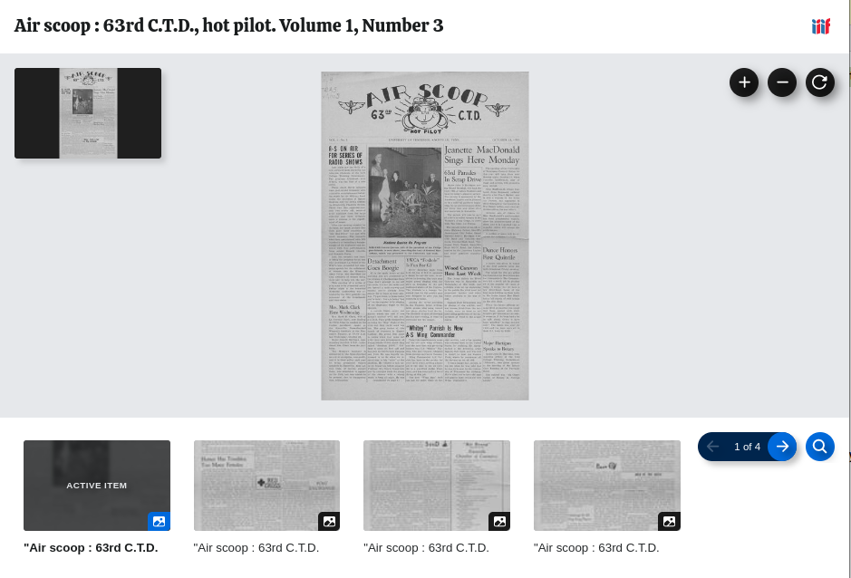
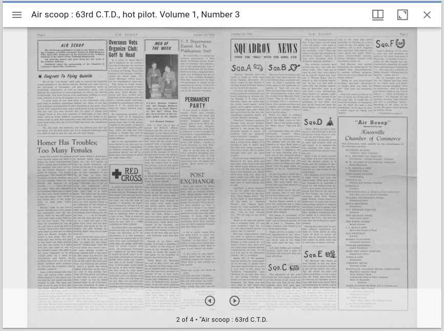
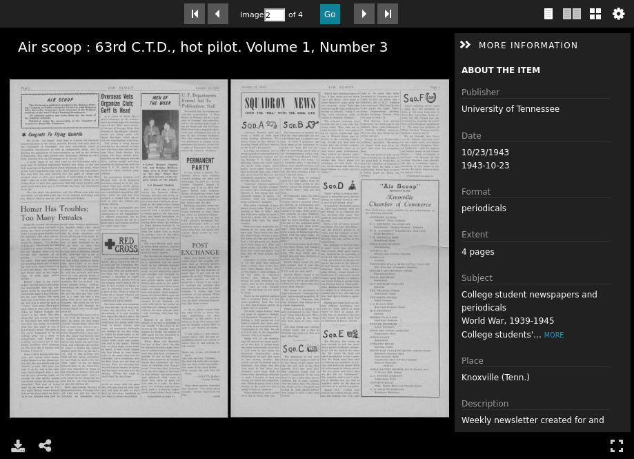

Books and Pages
===============

About
-----

In University of Tennessee Digital Collections, digital objects that are made up of many works that cannot stand on
their own and are ordered are called :code:`Books`.  :code:`Books` are considered to be paged and should be displayed
two up in a page turning viewer.  :code:`Books` are different from :code:`Compound Objects` in that books only consist of
:code:`Page` works that cannot live on their own while compound objects can be made up of any work type. While :code:`Pages`
should be indexed, they should not be described in an OAI record or listed as a member of a IIIF collection. Similarly,
a :code:`Page` can be represented by a manifest but should only be :code:`partOf` a :code:`Book`.

Fedora Model
------------

Book works have properties that express they are a book and which collections they belong to.  If a PDF was generated on
ingest, it will also have a property stating this.  Ideally, this PDF would be available in the IIIF manifest but isn't
currently. The page has properties stating that it is a :code:`Page` work, the book it is a member of, where it appears in
the book, and whether or not there is related OCR / HOCR.

.. code-block:: turtle

    @prefix fedora: <info:fedora/fedora-system:def/relations-external#> .
    @prefix fedora-model: <info:fedora/fedora-system:def/model#> .
    @prefix islandora: <http://islandora.ca/ontology/relsext#> .

    <info:fedora/ascoop:1507160011> islandora:create_pdf "true" ;
        fedora-model:hasModel <info:fedora/islandora:bookCModel> ;
        fedora:isMemberOfCollection <info:fedora/collections:ascoop> .

    <info:fedora/ascoop:1507160012> islandora:generate_ocr "TRUE" ;
        islandora:isPageNumber "1" ;
        islandora:isPageOf <info:fedora/ascoop:1507160011> ;
        islandora:isSection "1" ;
        islandora:isSequenceNumber "1" ;
        fedora-model:hasModel <info:fedora/islandora:pageCModel> ;
        fedora:isMemberOf <info:fedora/ascoop:1507160011> .

IIIF Manifest
-------------

:code:`Book` works are the only work type that have a :code:`behavior` of :code:`paged`.

.. literalinclude:: ../fixtures/ascoop_book.json
    :language: json
    :linenos:
    :lines: 479-481

:code:`Book` works and :code:`CompoundObject` works are different from other manifests in that they consist of multiple
:code:`Canvases`. In the :code:`items` property, each :code:`Page` work is a :code:`Canvas`. Each :code:`Canvas` has the
following properties:  :code:`id`, :code:`type`, :code:`label`, :code:`width`, :code:`height`, :code:`thumbnail`,
:code:`items`, and :code:`seeAlso`.

A unique :code:`id` for representing the :code:`Canvas` is generated with the appropriate :code:`type`. The :code:`label`
is the value of :code:`fgsLabel` of the page, while :code:`width`, :code:`height`, and :code:`thumbnail` are generated
by the Cantaloupe response for the size and services related to the :code:`TN` datastream.

.. literalinclude:: ../fixtures/ascoop_book.json
    :language: json
    :linenos:
    :lines: 195-220,257

The :code:`items` property should have 1 :code:`AnnotationPage` with 1 :code:`Annotation`.  The :code:`Annotation` should
have a :code:`motivation` of :code:`painting` based on the :code:`JP2` datastream that targets the :code:`Canvas`.

.. literalinclude:: ../fixtures/ascoop_book.json
    :language: json
    :linenos:
    :lines: 194-197,220-248, 257, 447
    :emphasize-lines: 3, 27

Each :code:`Canvas` also has a :seeAlso: property that points at the page's :code:`HOCR`:

.. literalinclude:: ../fixtures/ascoop_book.json
    :language: json
    :linenos:
    :lines: 249-256

Viewing Experience
------------------

Our books should be rendered appropriately in a variety of viewers.

In Clover, books are rendered but not paged since Clover does not support two up.

In Mirador, books are paged.

In Universal Viewer, books are rendered but not paged by default. Universal Viewer instead shows everything as individuals
with the option for two up.

