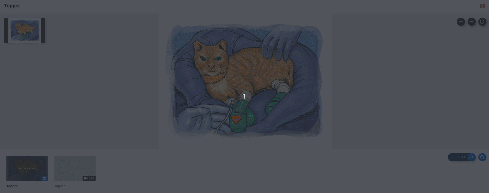
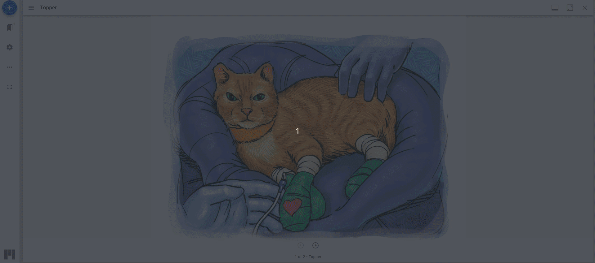
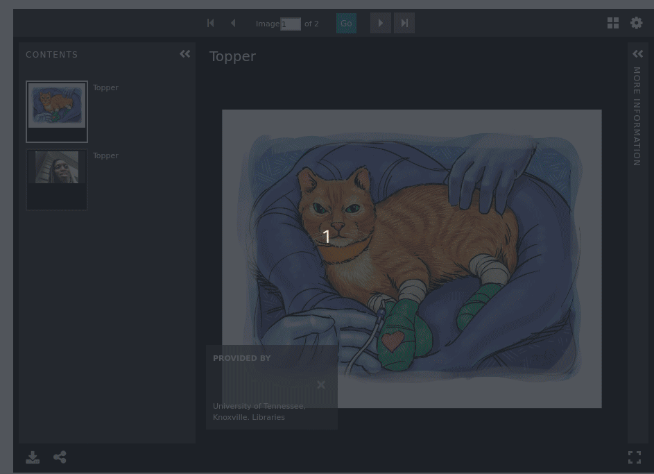

Compound Objects
================

About
-----

In University of Tennessee Digital Collections, digital objects that are made up of multiple works of various work types
that can all stand alone in the wild are considered to be :code:`Compound Objects`. :code:`Compound Objects` are not
historically considered to be paged and instead seen as related individuals. :code:`Compound Objects` are different from
:code:`Books` in these regards since :code:`Books` are paged and are made up of only :code:`Pages`. Since the works
that make up :code:`Compound Objects` can stand alone in the wild, they should not only be indexed but also found in OAI
and as members of IIIF collections.

Fedora Model
------------

Compound objects always have properites describing their work type and the collection(s) in which they belong. There
parts also have these properties plus a property for describing the compound object(s) of which they belong plus unique
properties that describe how they are ordered in a specific compound object.  For this reason, a Work could be a member
of multiple compound objects.

.. code-block:: turtle

    @prefix fedora: <info:fedora/fedora-system:def/relations-external#> .
    @prefix fedora-model: <info:fedora/fedora-system:def/model#> .
    @prefix islandora: <http://islandora.ca/ontology/relsext#> .

    <info:fedora/rftaart:74> fedora-model:hasModel <info:fedora/islandora:compoundCModel> ;
        fedora:isMemberOfCollection <info:fedora/collections:rftaart>,
            <info:fedora/collections:rftacuratedart> .

    <info:fedora/rftaart:42> islandora:isSequenceNumberOfrftaart_74 "1" ;
        fedora-model:hasModel <info:fedora/islandora:sp_large_image_cmodel> ;
        fedora:isConstituentOf <info:fedora/rftaart:74> ;
        fedora:isMemberOfCollection <info:fedora/collections:rftaart> .

    <info:fedora/rftaart:51> islandora:isSequenceNumberOfrftaart_74 "2" ;
        fedora-model:hasModel <info:fedora/islandora:sp_videoCModel> ;
        fedora:isConstituentOf <info:fedora/rftaart:74> ;
        fedora:isMemberOfCollection <info:fedora/collections:rftaart> .

IIIF Manifest
-------------

The IIIF manifest for a :code:`Compound Object` work inherits the basic format for other manifests. For more information, see
:ref:`Base Manifest Properties`.

The IIIF manifest for a :code:`Compound Object` most closely follows that of a :code:`Book`. Like it, the
:code:`Compound Object` has a :code:`behavior` property, but this time its array includes the string value
:code:`individuals` meaning that the included Canvases of the work are distinct views, and should not be presented in a
page-turning interface.

Similarly, like :code:`Book`, the items property can consist of many canvases. Like all :code:`Canvases`, the contents
of the canvas has properties like :code:`id` and :code:`type`, but the details of most property values are dictated by
the work type of the :code:`Work` the :code:`Canvas` is based on.  For instance, if the :code:`Canvas` is based on a video,
it too will likely have a :code:`annotations` property that points at its transcript(s).

.. literalinclude:: ../fixtures/rftaart_74.json
    :language: json
    :linenos:
    :lines: 167, 317-324, 365-389, 510-511

For details on the various types that can make up a canvas, see :ref:`Audio Works`, :ref:`Large Image Works`, or
:ref:`Video Works`.

:code:`Compound Object` manifests are also different in that their :code:`Canvases` have descriptive properties like
:code:`metadata`, :code:`summary`, :code:`rights`, and :code:`requiredStatement`.

.. literalinclude:: ../fixtures/rftaart_74.json
    :language: json
    :linenos:
    :lines: 167, 317-324, 390-511

This is because parts of :code:`Compound Objects` can live in the wild and have their own descriptive properties.

Viewing Experience
------------------

Our compound objects will render in a variety of viewers.  They work just as you'd expect if all canvases are image-like.
When they canvases are mixed, results are mixed.

In Clover, our compound objects work just like you'd expect.

In Mirador, everything works but with no transcripts for audio or video.  Also, navigation gets a little weird when an
audio or video manifest is encountered.

In Universal Viewer, compound objects work as long as there and no audio or video canvases.

