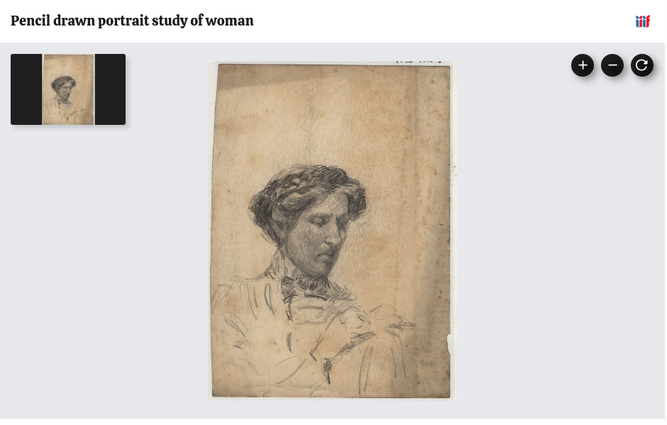
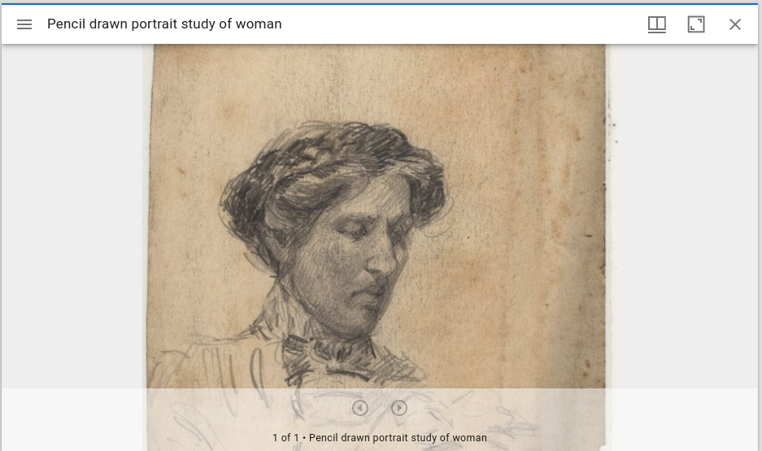
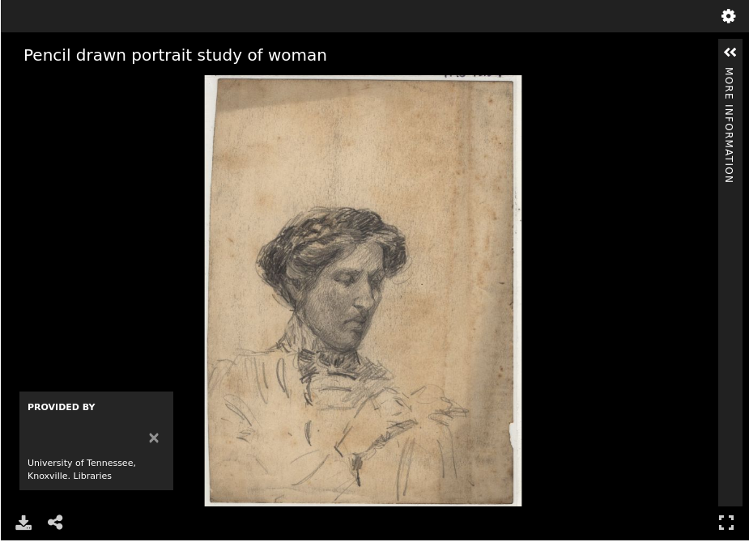

Large Image
===========

About
-----

In University of Tennessee Digital Collections, digital objects that are based on a :code:`JP2` or :code:`TIFF` and can
stand alone in the wild with a metadata file are considered to be `large images`. Large images differ from pages in that
pages do not make sense outside of the context of the book. Like most other content types, large images can be a part of
a compound object.

Fedora Model
------------

A large image has very few structural properties. In our current repository, it should always have a :code:`fedora-model:hasModel`
stating its a large image and a :code:`fedora:isMemberOfCollection` property stating its relationship to various collections.

.. code-block:: turtle

    @prefix fedora: <info:fedora/fedora-system:def/relations-external#> .
    @prefix fedora-model: <info:fedora/fedora-system:def/model#> .

    <info:fedora/acwiley:280> fedora-model:hasModel <info:fedora/islandora:sp_large_image_cmodel> ;
        fedora:isMemberOfCollection <info:fedora/collections:acwiley> .

As stated above, the object can also be part of 1 or more compound objects. In this case, it still has the same
:code:`fedora-model:hasModel` relationship but also has a :code:`fedora:isConstituentOf` relationship with an
:code:`islandora:isSequenceNumberOfpcard00_100201`.  See the section on compound objects for more information.

.. code-block:: turtle

    @prefix fedora: <info:fedora/fedora-system:def/relations-external#> .
    @prefix fedora-model: <info:fedora/fedora-system:def/model#> .
    @prefix islandora: <http://islandora.ca/ontology/relsext#> .

    <info:fedora/100201:7> islandora:isSequenceNumberOfpcard00_100201 "2" ;
        fedora-model:hasModel <info:fedora/islandora:sp_large_image_cmodel> ;
        fedora:isConstituentOf <info:fedora/pcard00:100201> ;
        fedora:isMemberOfCollection <info:fedora/gsmrc:pcard00> .

IIIF Manifest
-------------

The IIIF manifest for an image inherits the basic format for other manifests. For more information, see
:ref:`Base Manifest Properties`.

The :code:`items` property of the manifest for a Large Image has one canvas that points at its large image. The
:code:`Canvas` should have :code:`id`, :code:`type`, :code:`label`, :code:`thumbnail`, :code:`width`, :code:`height`,
and :code:`items` properties following the IIIF Presentation v3 specification.  Cantaloupe provides as the source for
values related to :code:`thumbnail`, :code:`width`, and :code:`height`.

.. literalinclude:: ../fixtures/acwiley_280.json
    :language: json
    :linenos:
    :lines: 156-182,211

The :code:`items` property on the :code:`Canvas` consists of one :code:`AnnotationPage`.  An :code:`AnnotationPage` is
an ordered list of annotations. The :code:`AnnotationPage` has an :code:`id`, :code:`type`, and :code:`items` property.

In the Large Image work type, the :code:`items` property on the :code:`AnnotationsPage` has one :code:`Annotation`.
:code:`Annotations` associate content resources with Canvases. The same mechanism is used for the visible and/or audible
resources as is used for transcriptions, commentary, tags and other content. This provides a single, unified method for
aligning information, and provides a standards-based framework for distinguishing parts of resources and parts of
Canvases.

The :code:`Annotation` has :code:`id`, :code:`type`, :code:`motivation`, :code:`body`, and :code:`target` properties.
Annotations that add the primary content to viewer always have th :code:`motivation` of :code:`painting`. The :code:`body`
property is populated primarily by the Cantaloupe Image API response and the :code:`Annotation` targets the canvas with the
:code:`target` property.

You can see a complete :code:`Annotation` for the large image work type here:

.. literalinclude:: ../fixtures/acwiley_280.json
    :language: json
    :linenos:
    :lines: 188-207

For more information, see `Additional types <https://iiif.io/api/presentation/3.0/#22-additional-types>`_.

Viewing Experience
------------------

Large images work similarly in a variety of IIIF viewers.

