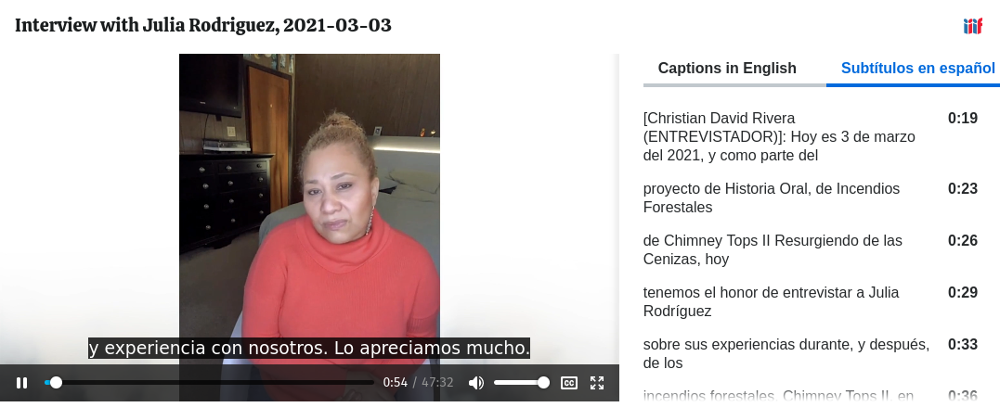
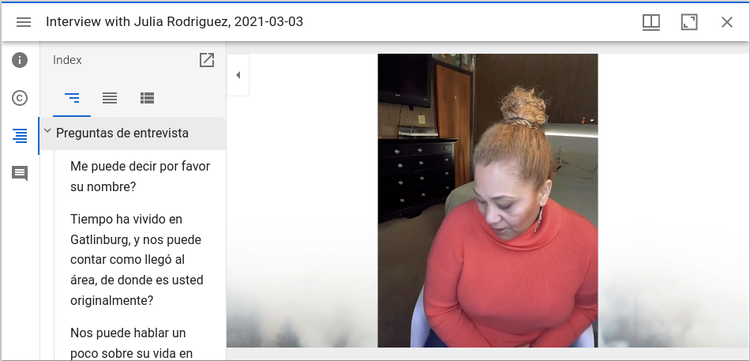
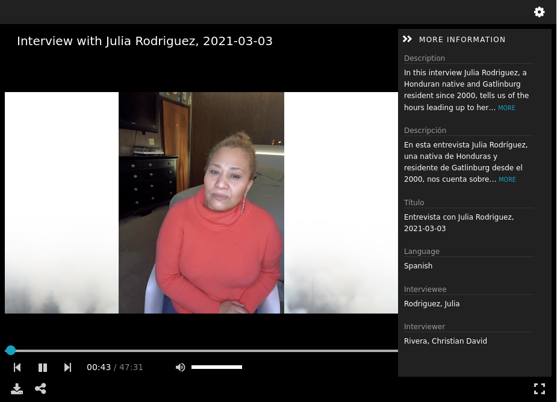

Videos
======

About
-----

In University of Tennessee Digital Collections, digital objects that are moving images are considered to be Videos. Videos
usually consist of a preservation file stored in Matroska format with a MP4 access copy.  The MP4 may be curated and have
front matter and other content that is not present in the preservation copy. Its duration may also be different.  Like
other content models, a :code:`Video` may be a part of a :code:`Compound Object`.

Fedora Model
------------

Videos always have structural properties that state their content model the collections in which they are members.  Their
files mayb also have a :code:`bibframe:duration` that state how long they are.

.. code-block:: turtle

    @prefix fedora: <info:fedora/fedora-system:def/relations-external#> .
    @prefix fedora-model: <info:fedora/fedora-system:def/model#> .
    @prefix islandora: <http://islandora.ca/ontology/relsext#> .
    @prefix bibframe: <http://id.loc.gov/ontologies/bibframe/#> .

    <info:fedora/rfta:8> fedora-model:hasModel <info:fedora/islandora:sp_videoCModel> ;
        fedora:isMemberOfCollection <info:fedora/collections:rfta>, <info:fedora/collections:rftatest> .

    <info:fedora/rfta:8/MP4> bibframe:duration "00:57:15" .

If they are parts of compound objects or have restrictions, they may also have additional properties.

IIIF Manifest
-------------

The IIIF manifest for a :code:`Video` inherits the basic format for other manifests. For more information, see
:ref:`Base Manifest Properties`.

The :code:`items` property of the manifest for a Video has one canvas that points at the access proxy of the video. The
:code:`Canvas` should have :code:`id`, :code:`type`, :code:`label`, :code:`thumbnail`, :code:`width`, :code:`height`,
:code:`duration`, :code:`items`, and :code:`annotations` properties following the IIIF Presentation v3 specification.

The :code:`thumbnail` property for a :code:`Canvas` is a little different than in other work types. Instead of one value,
videos have two JSON like objects that are published to the :code:`thumbnail` property.  Like other work types, one relates
to the TN datastream of a work and is an image. All of the properties in this thumbnail should be provided by Cantaloupe.
The other is a 15 second clip of the video.  Currently, that 15 minutes relates to the time between 60 and 75 seconds.
Ideally, this would be able to be curated through a property or generated more scientifically.

.. literalinclude:: ../fixtures/rfta_165.json
    :language: json
    :linenos:
    :lines: 251-275

The :code:`duration` value is derived from the :code:`bibframe:duration` property that describes the work's :code:`MP4`
datastream.

Currently, the :code:`height` and :code:`width` properties are hard coded.  This should ideally be rethought a be based
on the actual height and width of the access proxy.

Video works may have one or more subtitle or closed captioning file. When they do, they are added as :code:`AnnotationPages`
in the :code:`annotations` property. Right now, a closed captioning file can only be Spanish or English and based on the
name of the datastream the correct Annotation is added with the motivation of supplementing. The :code:`TRANSCRIPT` datastream
is reserved for English and the :code:`TRANSCRIPT-ES` datastream is reserved for Spanish:

.. literalinclude:: ../fixtures/rfta_165.json
    :language: json
    :linenos:
    :lines: 301-342

When completed, the :code:`items` property should look like this:

.. literalinclude:: ../fixtures/rfta_165.json
    :language: json
    :linenos:
    :lines: 242-251, 276-279, 300, 301, 342-344

Videos are also special in that the manifest may have a :code:`structures` property with ranges.  This property provides
a table of contents of sorts that may be functional in some viewers according to IIIF presentation v3 specification.

The :code:`structures` property has :code:`1-n` ranges declared in it. In our sample we have 4:

.. literalinclude:: ../fixtures/rfta_165.json
    :language: json
    :linenos:
    :lines: 380-389, 645-655, 911-921, 1012-1014

Each of these ranges provide independent navigation.  These values are derived from the :code:`MODS` datastream of the work
in its pbcore extension section. This section is segmented into many parts.  Each part has a :code:`partType` attribute
that determines which section it should belong to:

.. code-block:: xml
    :emphasize-lines: 2

    <pbcore:pbcorePart
        partType="Preguntas de entrevista"
        startTime="00:01:07"
        endTime="00:01:15">
        <pbcore:pbcoreIdentifier source="local">2021_03_03_Rodriguez_Julia_esQ1</pbcore:pbcoreIdentifier>
        <pbcore:pbcoreTitle>Me puede decir por favor su nombre?</pbcore:pbcoreTitle>
        <pbcore:pbcoreDescription>Pregunta 1</pbcore:pbcoreDescription>
    </pbcore:pbcorePart>

In the :code:`items` property of each Range, are many ranges based on each :code:`pbcore:pbcorePart`. In these ranges,
there is a :code:`label` derived from the :code:`pbcore:pbcoreTitle` and a :code:`items` property with a :code:`Canvas`
that references the associated video with a timestamp derived from the :code:`startTime` and :code:`endTime` information.

.. literalinclude:: ../fixtures/rfta_165.json
    :language: json
    :linenos:
    :lines: 390-404
    :emphasize-lines: 6,10

Viewing Experience
------------------

Our videos work well in IIIF viewers that are designed for Video and to a lesser extent in other viewers.

For RFTA, we deliver videos in the Canopy "built-in" viewer.  This viewer makes use of captions, transcripts, and structures
and ranges.

The Clover viewer offers a similar experience but with no structures or ranges.

Structures and ranges are displayed in Mirador, but do not currently function.  Similarly, there are no closed captioning
options.

A limited viewing experience is available in Universal Viewer.

