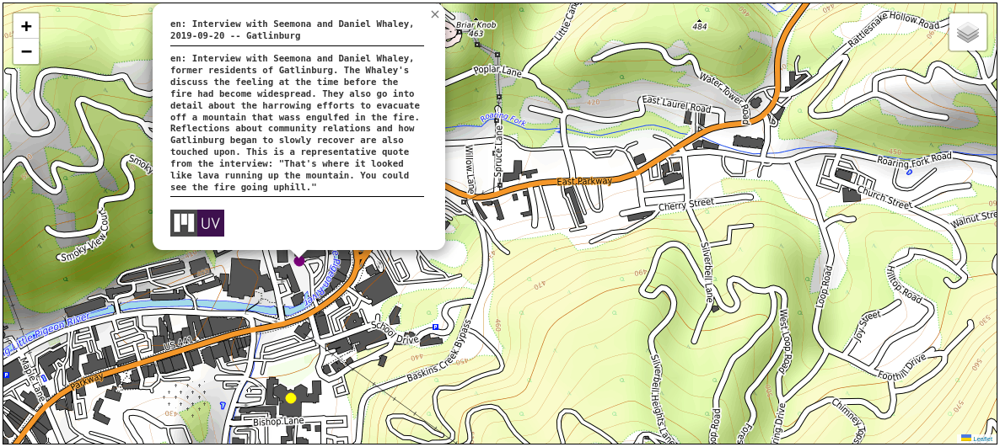
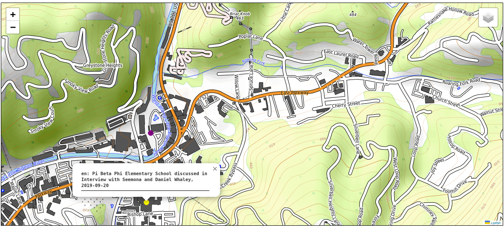

.. _The navPlace Property:

The navPlace Property
=====================

About
-----

Many UTK works that manifests describe include cartographic and coordinate information. This document details how we will
implement :code:`navPlace` for our works so that IIIF viewers that support the property can display our works on a map.

@context
--------

The :code:`navPlace` property exists in a `separate IIIF extension <http://iiif.io/api/extension/navplace/context.json>`_.
In order to use :code:`navPlace`, we must include this extension, `<http://iiif.io/api/extension/navplace/context.json>`_,
in the :code:`@context` property before the `<http://iiif.io/api/presentation/3/context.json>`_ value.

.. code-block:: json

    {
        "@context":[
            "http://iiif.io/api/extension/navplace/context.json",
            "http://iiif.io/api/presentation/3/context.json"
        ]
    }

Notes about navPlace
--------------------

The :code:`navPlace` property is valid on a :code:`Collection`, :code:`Manifest`, :code:`Range`,
or :code:`Canvas`.  In our implementation, :code:`navPlace` is ever only found on the :code:`Manifest` or in a
:code:`Range` with an :code:`items` property that represents a geographic location.

Unlike other properties, :code:`navPlace` follows a specific pattern. The value of the property must be a JSON object
that follows the requirements for a GeoJSON Feature Collection as described in
`Section 2.2.2 <https://iiif.io/api/extension/navplace/#222-feature-collection>`_. The value should be an embedded
Feature Collection. However, the value may be a referenced Feature Collection. Feature Collections referenced in the
:code:`navPlace` property must have the :code:`id` and :code:`type` properties. Referenced Feature Collections must not
have the :code:`features` property, such that clients are able to recognize that it should be retrieved in order to be
processed.

navPlace on the Manifest
------------------------

For our manifests, if a work has a match for the XPATH query :code:`subject[@authority="geonames"]/cartographics/coordinates`
on its MODS record, it will get a :code:`navPlace` property on the :code:`Manifest`.

For our manifests, the :code:`navPlace` property always have three properties: :code:`id`, :code:`type`, :code:`features`.
The value of the :code:`type` property is :code:`FeatureCollection`. The :code:`id` property is unique for the
:code:`FeatureCollection` and is equal to the base manifest :code:`id` concatenated with the value :code:`/feature-collection/1`.

.. code-block:: json

    {
        "navPlace":
            "id": "https://digital.lib.utk.edu/notdereferenceable/assemble/manifest/rfta/8/feature-collection/1",
            "type": "FeatureCollection",
            "features": []
    }

The :code:`features` property is an array. In the array are :code:`Feature` bodies for each matching value of
:code:`mods:subject[@authority="geonames"]/mods:cartographics/mods:coordinates`.  Each :code:`Feature` has the following
properties: :code:`id`, :code:`type`, :code:`properties`, and :code:`geometry`.

The :code:`type` property is always :code:`Feature`.  To ensure uniqueness, each :code:`Feature` :code:`id` is equal to
the :code:`id` of the :code:`id` of the Manifest concatenated with :code:`/feature/1`. The :code:`properties` property
is described `here <https://iiif.io/api/extension/navplace/#32-context-considerations-for-geojson-ld-properties>`_.
For our implementation, the :code:`label` property is the only thing used and it is equal to a concatenation of the Manifest
label and the related geographic location from the corresponding :code:`mods:subject[@authority="geonames]/mods:geographic`.
Finally, :code:`geometry` will always be a :code:`Point` with the cartographics in the :code:`coordinates` property in the format of "longitude, latitude".

.. code-block:: json

    {
        "navPlace":
            {
                "id": "https://digital.lib.utk.edu/notdereferenceable/assemble/manifest/rfta/8/feature-collection/1",
                "type": "FeatureCollection",
                "features": [
                    {
                        "id":"https://digital.lib.utk.edu/notdereferenceable/assemble/manifest/rfta/8/feature/1",
                        "type":"Feature",
                        "properties":{
                           "label":{
                              "en":[
                                 "Interview with Seemona -- Gatlinburg"
                              ]
                           }
                        },
                        "geometry":{
                           "type":"Point",
                           "coordinates":[
                              -83.51189,
                              35.71453
                           ]
                        }
                    }
                ]
        }
    }

navPlace on a Range
-------------------

If a manifest has ranges and has cartographic coordinates as described above, any Ranges that related to geographic data
are given a :code:`navPlace` property similar to what appears on a manifest. The :code:`navPlace` property is only added
if there is a match between its label and a :code:`subject[@authority]/geographic`. The one difference is that the label
will be the value of :code:`subject[@authority]/geographic` concatenated with " discussed in " and the title of the
manifest.

When the property is generated and added, it looks like this:

.. code-block:: json

    {
      "type": "Range",
      "id": "https:\/\/digital.lib.utk.edu\/notdereferenceable\/assemble\/manifest\/rfta\/8\/range\/places_mentioned\/1",
      "label": {
        "en": [
          "Chalet Village"
        ]
      },
      "navPlace": {
        "id": "https:\/\/digital.lib.utk.edu\/notdereferenceable\/featurecollection\/ChaletVillage\/1",
        "type": "FeatureCollection",
        "features": [
          {
            "id": "https:\/\/digital.lib.utk.edu\/notdereferenceable\/feature\/ChaletVillage\/1",
            "type": "Feature",
            "properties": {
              "label": {
                "en": [
                  "Chalet Village discussed in Interview with Seemona and Daniel Whaley, 2019-09-20"
                ]
              }
            },
            "geometry": {
              "type": "Point",
              "coordinates": [
                -83.5277175,
                35.7232049
              ]
            }
          }
        ]
      },
      "items": [
        {
          "type": "Canvas",
          "id": "https:\/\/digital.lib.utk.edu\/notdereferenceable\/assemble\/manifest\/rfta\/8\/canvas\/0#t=00:12:35,00:26:30"
        }
      ]
    }

navPlace Properties on Viewers
------------------------------

Currently, there is only one recognized viewer that supports :code:`navPlace`, `navPlace Viewer <https://github.com/CenterForDigitalHumanities/navplace-viewer/>`.
This viewer makes use of the property on the manifest and range.  It also will dereference the properties from both locations
when a collection manifest is passed to it.

For this example, we will pass `rfta:8 to the viewer <https://centerfordigitalhumanities.github.io/navplace-viewer/?iiif-content=https://digital.lib.utk.edu/assemble/manifest/rfta/8>`_.

A :code:`navPlace` body on the manifest is added to a map with a description and links to open the manifest in Universal
Viewer and Mirador:

A :code:`navPlace` body on a Range is added to the map, but only with the label.  In the future, we are hoping this will
change to include a content state URI that is passed to the viewers so that the corresponding timestamp can be opened:

