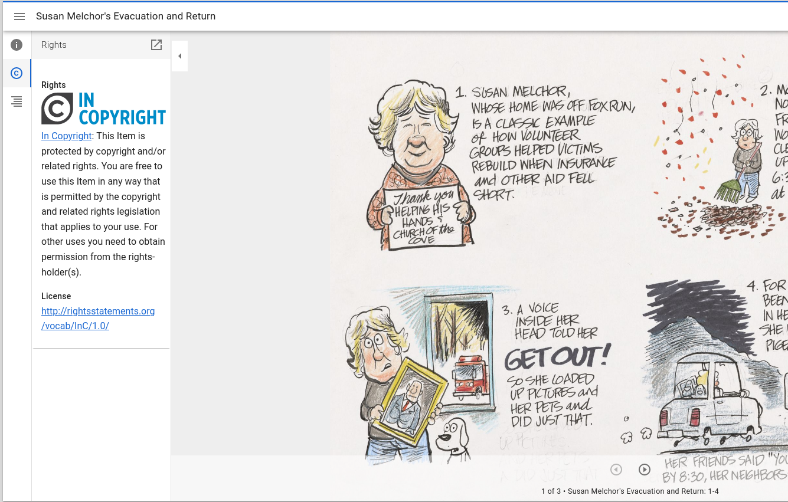
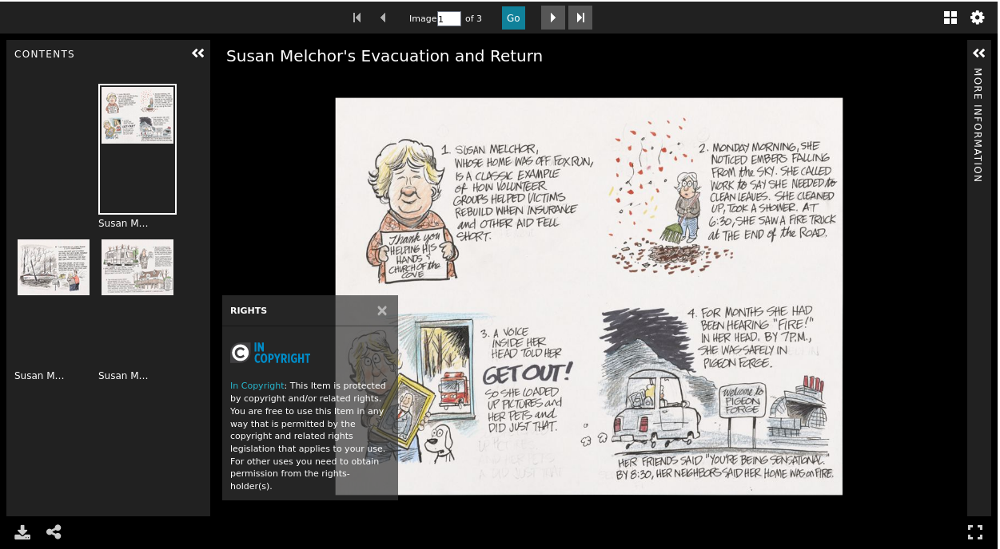

.. _Rights Information in requiredStatement:

Rights Information in requiredStatement
=======================================

About
-----

This section describes how Creative Commons and rightsstatements.org URIs are leveraged to generate rights information
in the :code:`requiredStatement` property of UT Libraries IIIF manifests.

Rights Statements
-----------------

Rights Statements are dereferenced from the value of :code:`mods:accessCondition/@xlink:href`. From the corresponding rdf,
the label, definition, and description are retrieved. The corresponding SVGs are "guessed" at following the standard
pattern for SVGs.

On serialization, the SVG is used in an :code:`img` wrapped in an :code:`a` that points at the human readable webpage at
rightsstatements.org. The label is wrapped in an :code:`a` that points at the human readable webpage at
rightsstatements.org followed by the definition.

The description is not currently used.

In various viewers, the rights information is rendered like so:

Creative Commons
----------------
